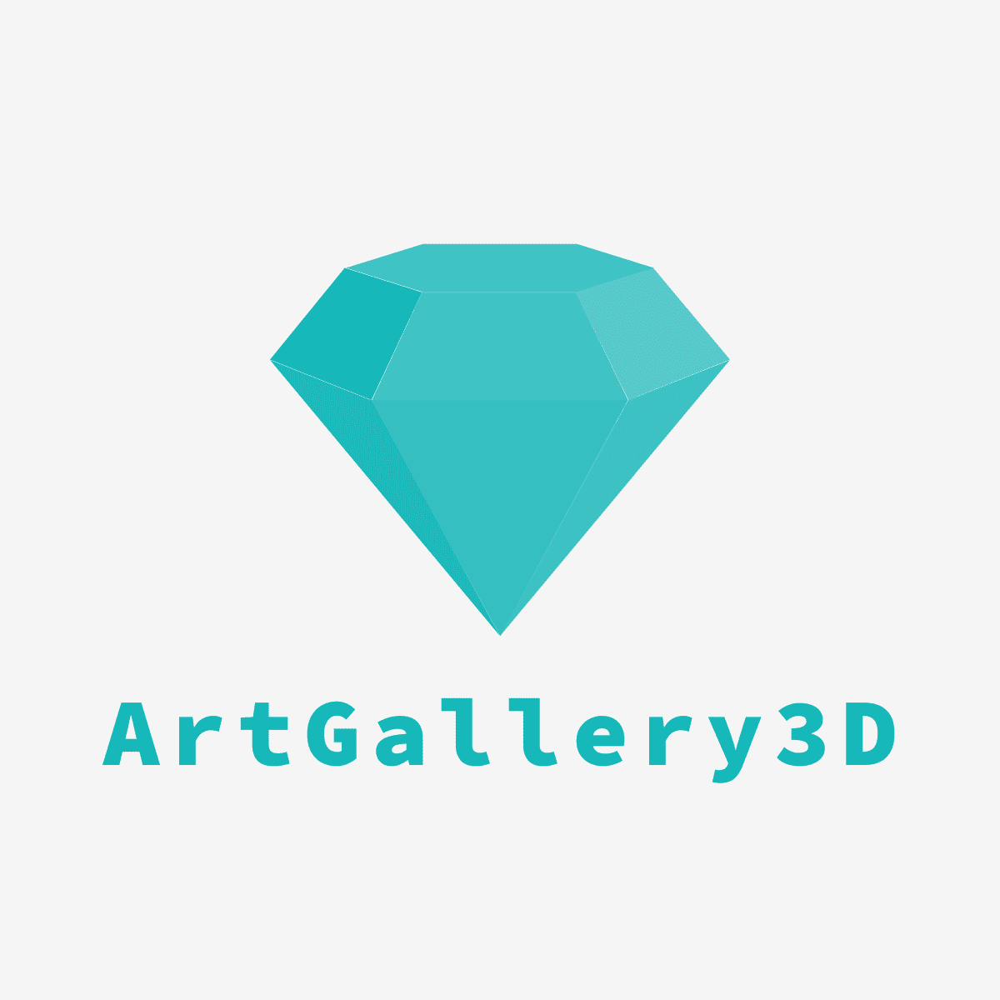

<!-- MARKDOWN LINKS & IMAGES -->

<!-- CHANGE THIS: PROJECT_URL, REPO_NAME -->

[status-icon]: https://img.shields.io/badge/status-active-success.svg
[project-url]: https://github.com/DamianTab/ArtGallery3D
[issues-icon]: https://img.shields.io/github/issues/DamianTab/ArtGallery3D.svg
[issues-url]: https://github.com/DamianTab/ArtGallery3D/issues
[pulls-icon]: https://img.shields.io/github/issues-pr/kylelobo/The-Documentation-Compendium.svg
[pulls-url]: https://github.com/DamianTab/ArtGallery3D/pulls
[license-icon]: https://shields.io/badge/license-Apache%202-blue.svg
[license-url]: /LICENSE
[author-url]: https://github.com/DamianTab

<p align="center">
  <a href="" rel="noopener">
 </a>
</p>


<h3 align="center">ArtGallery3D</h3>

<div align="center">
  
  [![Status][status-icon]][project-url]
  [![GitHub Issues][issues-icon]][issues-url]
  [![GitHub Pull Requests][pulls-icon]][pulls-url]
  [![License][license-icon]][license-url]
</div>

---

<p align="center"> Simple Java 3D game 
    <br> 
</p>

## 📝 Table of Contents
- [About](#about)
- [Technologies](#technologies)
- [Usage](#usage)
- [Getting Started](#getting_started)
- [Deployment](#deployment)
- [Authors](#authors)
- [Acknowledgments](#acknowledgement)

<br/>

## 🧐 About <a name = "about"></a>
This is simple and small 3D game that takes place in art gallery. Player is allowed to move around gallery, watch paintings and see other visitors (very simple model). Player collision system is provided.

<br/>

## ⛏️ Technologies <a name = "technologies"></a>
- **Java 11** - or higher
- **LWJGL 3.2.2** - Java library for 3D games
- **JOML 1.9.16** - Java mathematics
- **GLSL v330** - Shaders

<br/>
  
## 🏁 Getting Started <a name = "getting_started"></a>
These instructions will help you set up and run project on your local machine for development and testing purposes. See [deployment](#deployment) for notes on how to deploy the project on a live system.

<br/>
  
### Prerequisites
What things you need to install the software and how to install them.

```
maven
java 11+
```
Download all dependency through maven and run class ``src/main/java/Main.java``

<br/>


## 🎈 Usage <a name="usage"></a>
To move around use buttons `WSAD` and `mouse` to look around.

<br/>

## 🚀 Deployment <a name = "deployment"></a>
No possible deployment.

<br/>

## ✍️ Authors <a name = "authors"></a>
- [@DamianTab][author-url] - Idea & manager
- [@DMistera](https://github.com/DMistera)

<br/>

## 🎉 Acknowledgements <a name = "acknowledgement"></a>
